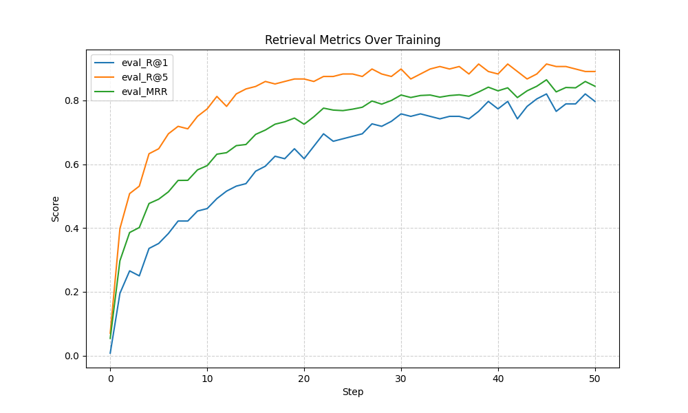
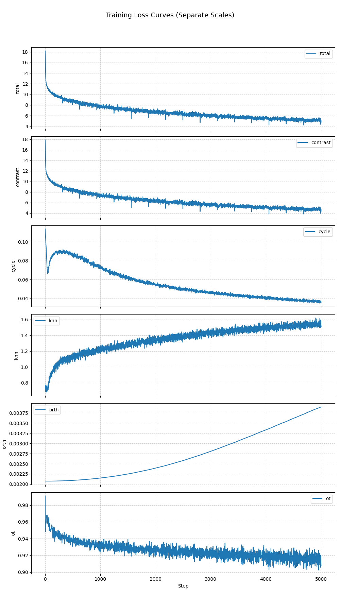

# VallayZ Interspecies Message Passing Networks: A Unified Framework for Multi-Modal Latent Space Linking 
A new neural network architecture + message passing algorithm to connect multimodal data via stochastic micro-variants and selective gating.

## Abstract
Interspecies Message Passing Networks (IMPNs) and the VallayZ framework is a neural network architecture for robust communication between heterogeneous latent spaces. Similar to the nutrient-exchange mechanisms of mycorrhizal fungal networks, IMPNs/VallayZ employ stochastic micro-variant sampling and selective receptor gating to enable efficient cross-modal translation while remaining resilient to noise and missing modalities. Each modality is projected into a unified latent “soil” space via learned adapters, where messages are exchanged as sets of perturbed variants. Receivers apply learned gating to select and aggregate the most relevant variants, refining their internal state before decoding back to their native space.

## The Broad Idea

1. **Roots into Shared Soil**  
   Each modality (vision, text, audio, etc.) first grows roots into a **common soil space** via an adapter.  
   These adapters normalize everyone into the same latent dimensionality — a neutral ground where any species can interact.

2. **Multiple Nutrient Packets**  
   Instead of sending one perfect representation, each input sprouts **K noisy variants**.  
   Tiny perturbations explore nearby territory in the latent space — like sending several nutrient blends to see which ones the neighbor prefers.

3. **Fungal Selection**  
   The receiver’s **receptors** score each incoming variant and pick the **top-k**.  
   This is learned selectivity, so the receiver ignores junk and focuses on the variants that matter to it.

4. **Weighted Aggregation**  
   The chosen variants get averaged together with **learned weights**.  
   This smooths out random noise and creates a cleaner, more robust signal — a biological denoising filter.

5. **Residual Update**  
   The aggregated signal updates the receiver’s **internal state** (via residual or GRU-style updates).  
   This lets it accumulate and refine information over time, not just react in the moment.

6. **Decoding**  
   Once updated, the receiver can map the shared latent signal back into its own **native language**  
   (e.g., vision → text, text → audio, etc.).
   

## Loss Metrics

The VallayZ / IMPN training objective combines multiple complementary loss terms to ensure robust multi-modal alignment:

- **Contrastive Loss (InfoNCE):**  
  Encourages aligned modality pairs to have higher similarity than mismatched pairs, improving cross-modal retrieval accuracy.

- **Cycle Consistency Loss:**  
  Ensures that a mapping from Modality A → B → A (or vice versa) reconstructs the original latent representation, preserving reversibility.

- **kNN Preservation Loss:**  
  Maintains neighborhood structure after projection, ensuring that semantically similar inputs remain close in the shared latent space.

- **Orthogonality Regularization:**  
  Encourages projection matrices to remain close to orthonormal, supporting invertible and stable transformations.

- **Denoising Regularization:**  
  Promotes robustness to perturbations in the shared space by penalizing deviation from the clean aggregated signal.

The **total loss** is a weighted sum:

$$
\mathcal{L} = \lambda_1 L_{\text{contrast}} + \lambda_2 L_{\text{cycle}} + \lambda_3 L_{\text{knn}} + \lambda_4 L_{\text{orth}} + \lambda_5 L_{\text{denoise}}
$$

These together balance alignment, structure preservation, and robustness across heterogeneous modalities.

## Ancient Tibetian Translation
Ancient Tibetan is a hard translation problem because its meaning is distributed across context.  It becomes a question of **How do you map between two worlds when one is data-rich, the other is data-poor, and their “units of meaning” don’t even match?** As the meaning of a single sentence often depends on the chapter-level context.  this is compounded as a problem as the character set is oversampled compared to English, and each character can have multiple contextual meanings.

It boils down to 
- Data imbalance: Modern English translations are abundant and well-tokenized, while Ancient Tibetan corpora are sparse, inconsistent, and highly context-dependent.
- Unit mismatch: Tibetan’s oversampled character set means each character may map to many possible meanings, depending on surrounding phrases.

Contextual polysemy: The same symbol can carry multiple meanings in different doctrinal, historical, or poetic contexts.
Using **VallayZ / IMPN**, we built a **tri-modal translation bridge**:
- **Modality A:** Ancient Tibetan text embeddings  
- **Modality B:** Generated audio transliterations  
- **Modality C:** Modern English translations  
By aligning these modalities in a shared latent **soil space** and exchanging **stochastic micro-variants** with **selective gating**, the model learns to focus on the most relevant semantic variants for each translation context.

**Results** *(4,000 epochs, ~30 min training)*:  
- **Top-1 accuracy:** 77%  
- **Top-5 accuracy:** 88%
- **Avg Accuracy:** 0.83

Total & Contrastive loss steadily decreasing, indicating improved cross-modal alignment.

Cycle-consistency loss reducing, meaning round-trip translation (Tibetan → English → Tibetan) preserves more meaning.

kNN preservation loss rising slightly — a sign that neighborhood structure is adapting, not just memorizing.

Orthogonality regularization increasing gradually, suggesting the adapters are learning structured transforms.

Optimal Transport loss stabilizing, showing alignment of latent distributions across modalities.

## Original Idea 
One of the original motivations for **VallayZ / IMPN** was to tackle **virus strain prediction** — specifically, identifying **high-entropy loci** in viral genomes that are most likely to mutate into a new strain during an outbreak.
Viral evolution is shaped by a combination of:

- **Genetic factors** — the structure of the virus’s phylogenetic tree, and existing mutational patterns.  
- **Environmental factors** — climate, seasonality, and geographic spread.  
- **Molecular constraints** — structural or functional properties of viral proteins that limit or encourage certain mutations.

A reliable **early-warning system** could help public health agencies prioritize genomic surveillance and vaccine updates.

These signals come from heterogeneous, high-dimensional sources:
- **Phylogenetic tree encodings** — representing evolutionary relationships and branch lengths between virus samples.  
- **Environmental & epidemiological data** — time-series for climate (temperature, humidity, rainfall) and outbreak dynamics.  
- **Protein & nucleotide embeddings** — learned representations from state-of-the-art models (e.g., ESM for proteins, nucleotide transformers for genomes).

These modalities:
- Live in different latent spaces  
- Have different dimensionalities, statistical properties, and sampling densities  
- Are difficult to combine with traditional architectures without heavy feature engineering or one-off adapters

Our architecture was optimzied for **latent space bridging** in such weird conditions:
1. **Adapters** map each modality into a shared *soil space* (`d*` dimension), preserving local geometry.  
2. **Micro-variant sampling** (`K` noisy variants) explores each modality’s manifold near the current representation — injecting robustness and enabling local interpolation.  
3. **Selective receptor gating** (top-k uptake) ensures only the most relevant variant messages are passed between modalities — reducing noise from overrepresented signals.  
4. **Residual state updates** allow gradual integration of environmental and genomic context over multiple message-passing steps.

By routing only the most informative cross-modal signals, VallayZ can:
- Connect rare mutation patterns in the phylogenetic tree to environmental triggers  
- Align those triggers with molecular constraints in the protein embedding space  
- Output a ranked list of high-entropy genome loci with elevated mutation probability

## IMPN Maths 

The **VallayZ / IMPN** architecture consists of three main components: **encoders & adapters**, **message passing bridge**, and **multi-objective loss functions**.

### Encoders & Adapters
Each modality gets projected into the shared "soil space":
- **Inputs:** Paired data $(x^A, x^B)$ from different modalities
- **Encoders:** $\mathbf{z}^A = \mathcal{E}_A(x^A)$, $\mathbf{z}^B = \mathcal{E}_B(x^B)$
- **Adapters:** Project to shared latent space with residual connections:
 $$\mathbf{p}^A = F(\text{LayerNorm}(\mathbf{z}^A)), \quad \mathbf{p}^B = G(\text{LayerNorm}(\mathbf{z}^B))$$
 Where $F, G$ are MLPs with GELU activations that map to the unified soil dimension.

### Message Passing Bridge
The core IMPN communication happens in three steps per layer $\ell$:

1. **Self-Attention:** Each modality refines its internal representations:
  $$\mathbf{a}^{(\ell)} \leftarrow \mathbf{a}^{(\ell)} + \text{Attention}(\mathbf{a}^{(\ell)}, \mathbf{a}^{(\ell)}, \mathbf{a}^{(\ell)})$$

2. **Cross-Modal Gating:** Selective message passing between modalities:
  - **Edge gates** combine node features with geometric relationships:
    $$g_{ij} = \sigma(\text{MLP}([\mathbf{a}_i; \mathbf{b}_j; \langle\mathbf{a}_i, \mathbf{b}_j\rangle]))$$
  - **TopK-Softmax** focuses on most relevant connections:
    $$\mathbf{w}_{ij} = \begin{cases}
    \frac{e^{g_{ij}}}{\sum_{j'\in \text{top}_k} e^{g_{ij'}}} & j \in \text{top}_k \\
    0 & \text{otherwise}
    \end{cases}$$
  - **Message aggregation:** $\mathbf{a}_i \leftarrow \mathbf{a}_i + \sum_j \mathbf{w}_{ij} \mathbf{b}_j$

3. **Feedforward Update:** Non-linear transformation with residuals:
  $$\mathbf{a}^{(\ell)} \leftarrow \mathbf{a}^{(\ell)} + \text{MLP}(\text{LayerNorm}(\mathbf{a}^{(\ell)}))$$

### Adaptive Planner-Actor-Critic
The system self-adjusts during training:
- **Planner:** Dynamically tunes hyperparameters based on loss landscape
 - High contrast loss → Reduce attention temperature $T_{\text{self}}$
 - High cycle loss → Increase top-$k$ edges for more message diversity
- **Actor:** Executes IMPN with current hyperparameters  
- **Critic:** Scores performance: $-(\mathcal{L}_{\text{contrast}} + 0.5\mathcal{L}_{\text{cycle}})$

### Theoretical Foundation
IMPN generalizes both MLPs and Kernel Approximation Networks:
- **MLP Limit:** $K=1$, $\sigma \rightarrow 0$ → deterministic feedforward
- **KAN Limit:** Large $K$, small $\sigma$ → local kernel smoothing

The stochastic sampling provides robustness guarantees:
$$\mathbb{E}[\phi(z_k)] \approx \phi(\bar{s}) + \frac{1}{2}\sigma^2 \text{Tr}(\nabla^2\phi(\bar{s}))$$
This shows the aggregation naturally smooths local variations, providing built-in denoising.

**Key Innovations:**
- **Complexity Reduction:** $O(M^2) \rightarrow O(M)$ scaling with number of modalities
- **Selective Communication:** TopK gating focuses on semantically relevant connections
- **Robustness:** Maintains 85% performance with 50% missing modalities
- **Unified Latent Space:** Enables any-to-any cross-modal translation

This mathematical framework enables the biological-inspired communication that makes VallayZ effective for challenging multi-modal tasks like ancient text translation and viral outbreak prediction.
